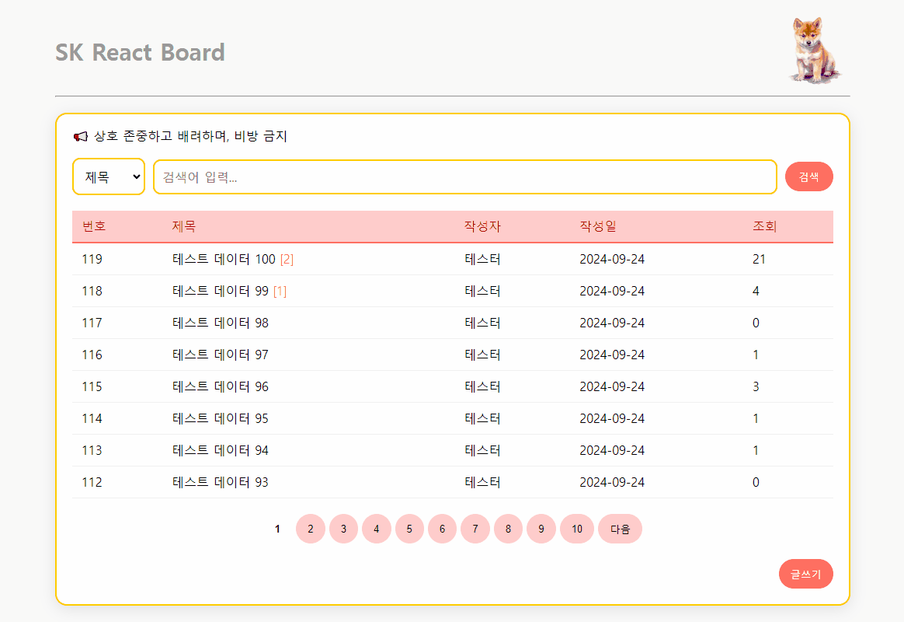

# SK React Board

이 프로젝트는 React를 사용하여 개발된 게시판 애플리케이션입니다. 사용자는 글을 작성, 수정, 삭제하고 댓글을 남길 수 있습니다.

## 기능

- **게시글 목록**: 페이지네이션을 통해 모든 게시글 조회
- **게시글 상세보기**: 선택한 게시글의 내용 확인
- **게시글 작성**: 새로운 게시글 작성 가능
- **게시글 수정**: 기존 게시글 수정
- **게시글 삭제**: 불필요한 게시글 삭제
- **댓글 기능**: 게시글에 댓글 추가 및 삭제
- **검색 기능**: 제목, 내용, 작성자로 게시글 검색

## 기술 스택

- **Frontend**: React, React Router
- **Backend**: Express (가상 API)
- **Axios**: API 요청을 위한 라이브러리
- **CSS**: 기본 스타일링

## 설치 및 실행

1. 프로젝트 클론하기:
   ```bash
   git clone <repository-url>
   cd sk-react-board
   ```

2. 의존성 설치:
   ```bash
   npm install
   ```

3. 애플리케이션 실행:
   ```bash
   npm start
   ```

4. 웹 브라우저에서 `http://localhost:3000`으로 접속

## 사용 방법

1. 게시글 목록에서 게시글 클릭하여 상세보기로 이동
2. `글쓰기` 버튼으로 새로운 게시글 작성
3. 게시글 상세 페이지에서 수정 및 삭제
4. 댓글 추가 및 삭제
5. 검색 기능으로 원하는 게시글 찾기


